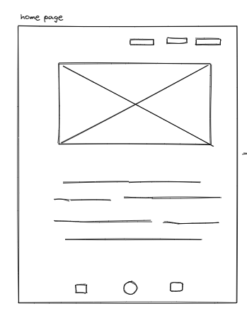
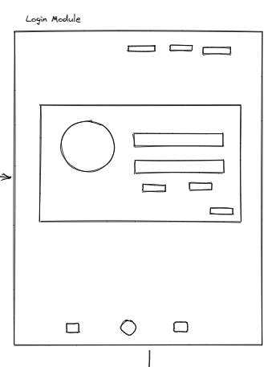
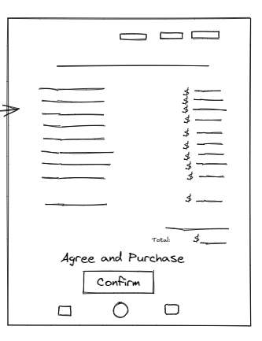

# Hootenanny Hero

# Hootenanny Hero
**Hootenanny Hero** is an event planning application built using HTML, CSS, JS, MySQL, Handlebars.js, Sequelize, Json, insomnia, prettier, bootstrap, express, Stripe and node.js.

## Images of the deployed website:
***

## Home Page
![Image of the Home page]

## Login Page
![Image of the Login Page]

## Create a Profile Page
![Image of the Profile Page]

## Event Building Page
![Image of the Event Building Page]

## Event Budgeting Page
![Image of the Event Budgeting page]

## Check Out Page
![Image of the Check Out page]

## User Story
***
Welcome to our event planner website, your one-stop-shop for creating unforgettable events. Whether you're planning a corporate conference, a wedding, or a birthday party, our website has everything you need to make your event a success. We also offer a range of event planning tools to help you stay organized and on top of your to-do list. With our event planner website, you can plan your dream event without the stress and hassle. So why wait? Sign up now and start planning your perfect event today! 

## As an event host:
*I would like to plan an event and have it tailored to my specific needs and vision.*
***
   **BUILDING** for my  event. Building a package of flowers, caterers, a venue, security and more,  all in one easy to use place. 

   **Budgeting** remaining within my budget is top priority. Having moany options to choose from and staying within my budget is my #1 goal while planning an event.

   **DISCOVER** new venues, themes and catering options, is a must.
 

 *I would like to save my profile, which would give me easy access to my saved events and future interests*
 ***
   
   **SAVE** my profile info i.e username, email address and events.

   **Build** my event as to my specific requirements easily.

   **Payment** to have everything booked and ready to go, incluiding my payment in one place.
 

 ## Wireframes
 ***
  **Wireframes** have been included, to show the conceptual design of the webiste. Giving the basic layout and functionality.
 

  ## Image of the Home Page Wireframe
  ***
  

  ## Image of the Login Page Wireframe
  ***
  

  ## Image of the Profile Page  Wireframe
  ***
  

  ## Image of the Event Buuilding Wireframe
  ***
  

  ## Image of the Event Budgeting Wireframe
  ***

  
 
  ## Image of the Checkout Page  Wireframe
  ***
  

  
 
  ## Features
  ***
  
  Features of the deployed application and repository are as follows:

  ## THIRD PARTY APIs
  ***
   Trefle | The plants API
   Trefle is a botanical API and data source.
       *http://trefle.io/

  ## TECHNOLOGY USED
  ***
    HTML 
    CSS 
    JS 
    MySQL
    Handlebars.js
    Seqealize
    Json 
    Express 
    Node.js
    Bootstrap
    Bcrypt
    Insomnia
    Prettier
    Stripe
 
  ## NEW TECHNOLOGY (NOT COVERED IN CLASS)
  ***
  *Stripe

## THE DEPLOYED REPO CAN BE FOUND AT THE FOLLOWING URL:
***
[ Deployed App ]

  ## INSTALLATION OF THE REPO FROM GITHUB
  ***
  A copy of the repository can be cloned at [Click Here](https://github.com/Vtsander/Hootenanny-Hero) Simply click on the repo and select **Clone**. From the drop down menu select the copy icon. Type (directly into your terminal):
  'git clone' + 'the repo link' + enter.

  ## FUTURE ITERATIONS
  ***
  **FORUMS**- We would like to implement a forum that will allow users to collaborate with like mind individuals. Where they can ask questions, share their experiences or simply make friends with fellow plant lovers.
  
  ## CREDITS
  ***

  **Collaborators**
  1. Marie Pacheco github: https://github.com/Lycanchic
  2. Veroneca Sander github: https://github.com/Vtsander
  3. Jingmey Sherpa github: https://github.com/jsherpss
 

- - -
© 2022 Trilogy Education Services, LLC, a 2U, Inc. brand. Confidential and Proprietary. All Rights Reserved.
