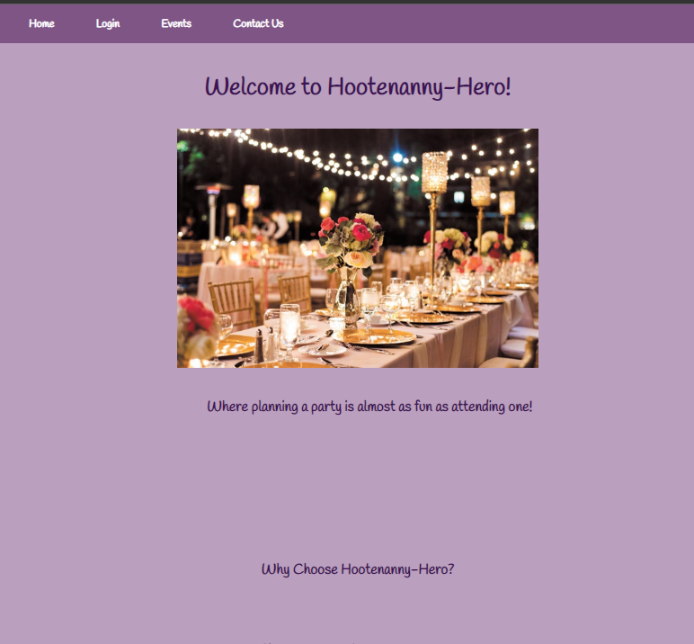
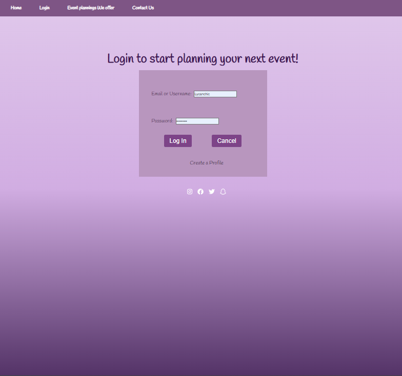
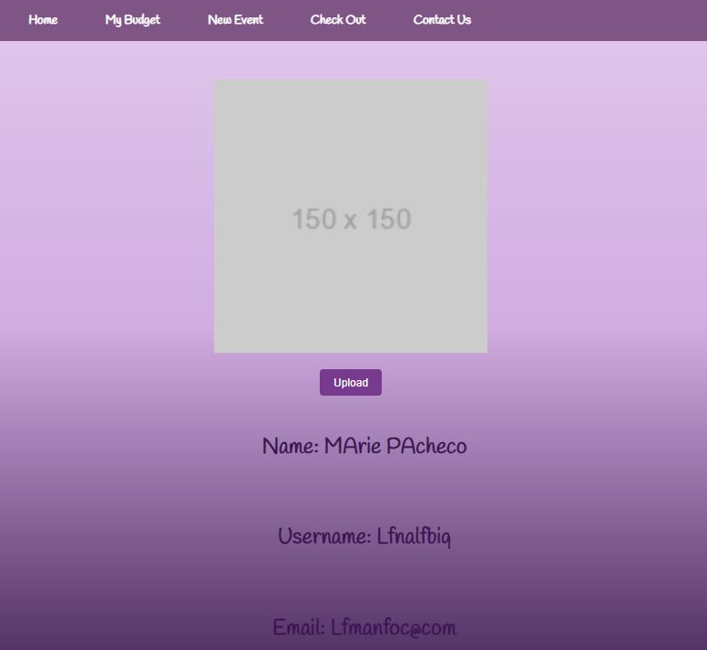
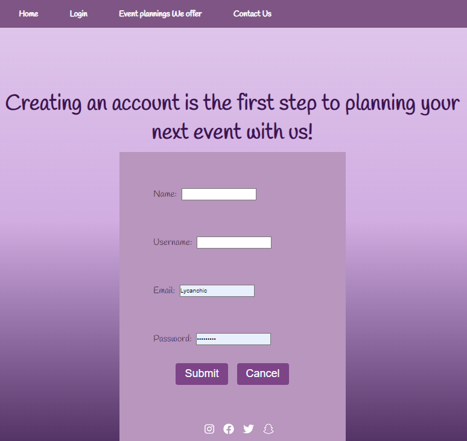
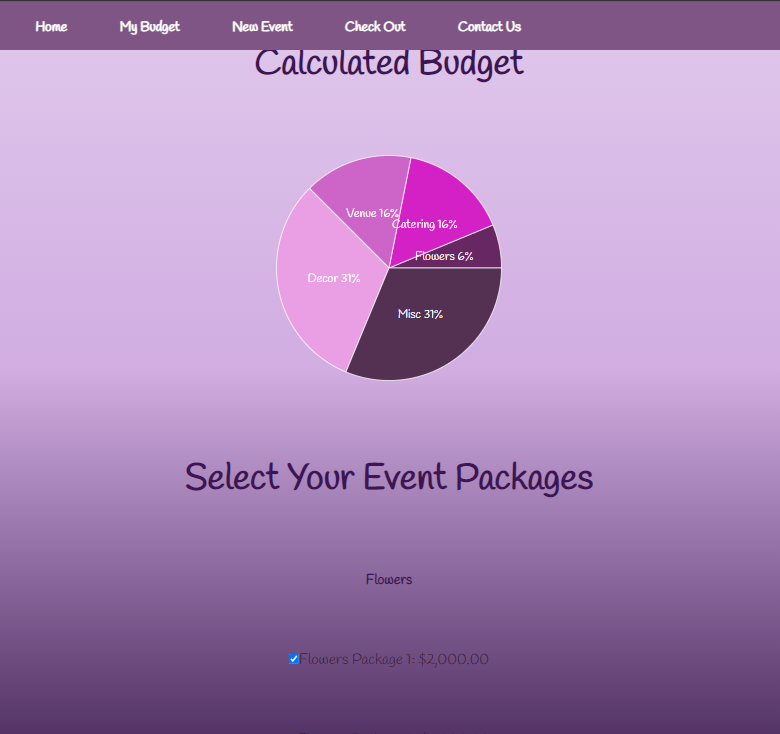
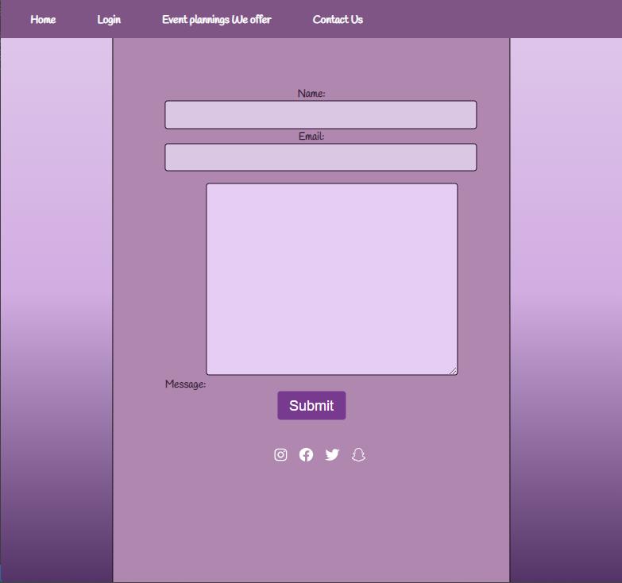
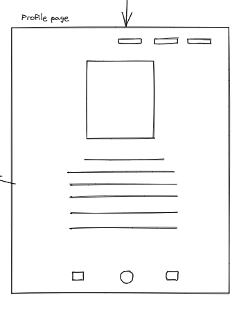
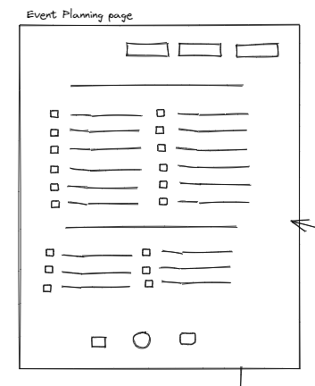
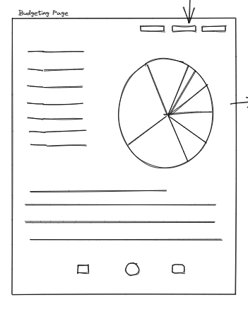

# Hootenanny Hero


**Hootenanny Hero** is an event planning application built using HTML, CSS, JS, Graphql, Firebase, Prettier, Confetti, React, Bcrypt, Chart.js, Bootstrap, Express, Stripe and Node.js.

<br>

## Images of the deployed website:
***

<br>

## Home Page


<br>

## Login Page


<br>

## Profile Page


<br>

## Create a Profile Page


<br>

## Congrats Page


<br>

## Event Budgeting Page


<br>

## Contact Us Page



<br>


## User Story
***
Welcome to our event planner website, your one-stop-shop for creating unforgettable events. Whether you're planning a corporate conference, a wedding, or a birthday party, our app has everything you need to make your event a success. We also offer a range of event planning tools to help you stay organized, on top of your to-do list and within your budget. With our event planner website, you can plan your dream event without the stress and hassle. So why wait? Sign up now and start planning your perfect event today! 

## As an event host:
***

<br>

*I would like to plan an event and have it tailored to my specific needs and vision.*
***
   **BUILDING** A package of flowers, caterers, venue, security and more, all in one easy to use place. 

   **Budgeting** remaining within my budget is top priority. Having many options to choose from and staying within my budget is my #1 goal while planning an event.

   **DISCOVER** new venues, themes, decor and catering options, is a must.
 

 <br>

 *I would like to save my profile, which would give me easy access to my current and past events and future interests*
 ***
   
   **SAVE** my username, email address and events.

   **Build** my event to my specific requirements easily.

   **Payment** to have everything booked and ready to go, incluiding my payment in one place.
 
 <br>

 ## Wireframes
 ***
  **Wireframes** have been included, to show the conceptual design of the webiste. Giving the basic layout and functionality.
 
 <br>

  ## Image of the Home Page Wireframe
  ***
  

<br>

  ## Image of the Login Page Wireframe
  ***
  

<br>

  ## Image of the Profile Page  Wireframe
  ***
  

<br>

  ## Image of the Event Building Wireframe
  ***
  

<br>

  ## Image of the Event Budgeting Wireframe
  ***

  
 
<br>

  ## Image of the Checkout Page  Wireframe
  ***
  

  <br>
 
  ## Features
  ***
  
  Features of the deployed application and repository are as follows:

<br>

  ## THIRD PARTY APIs
  ***
   [ Api info ]

   <br>

  ## TECHNOLOGY USED
  ***
    HTML 
    CSS 
    JS 
    Mongodb
    Mongoose
    Graphql
    Json 
    Express 
    Node.js
    Bootstrap
    Bcrypt
    Firebase
    Chart.js
    Prettier
    Confetti
    Stripe
 
<br>

  ## NEW TECHNOLOGY (NOT COVERED IN CLASS)
  ***
  *Stripe

<br>

## THE DEPLOYED REPO CAN BE FOUND AT THE FOLLOWING URL:
***

[Click Here](https://fabulous-entremet-fa0b27.netlify.app/)

<br>

  ## INSTALLATION OF THE REPO FROM GITHUB
  ***
  A copy of the repository can be cloned at [Click Here](https://github.com/Vtsander/Hootenanny-Hero/fork) Simply click on the repo and select **Clone**. From the drop down menu select the copy icon. Type (directly into your terminal):
  
  ```
  'git clone' + 'the repo link' + enter.
  ```

  <br>

  ## FUTURE ITERATIONS
  ***
  **FUTURE ITERATIONS**- 

  Allow clients to make tailored packages for thier events. As well as saving photos, venues and vendors to their profile for easy sharing and referencing.

  <br>
  
  ## CREDITS
  ***

  **Collaborators**
  1. Marie Pacheco github: https://github.com/Lycanchic
  2. Veroneca Sander github: https://github.com/Vtsander
  3. Jingmey Sherpa github: https://github.com/jsherpss
 
 <br>

- - -
© 2022 Trilogy Education Services, LLC, a 2U, Inc. brand. Confidential and Proprietary. All Rights Reserved.
